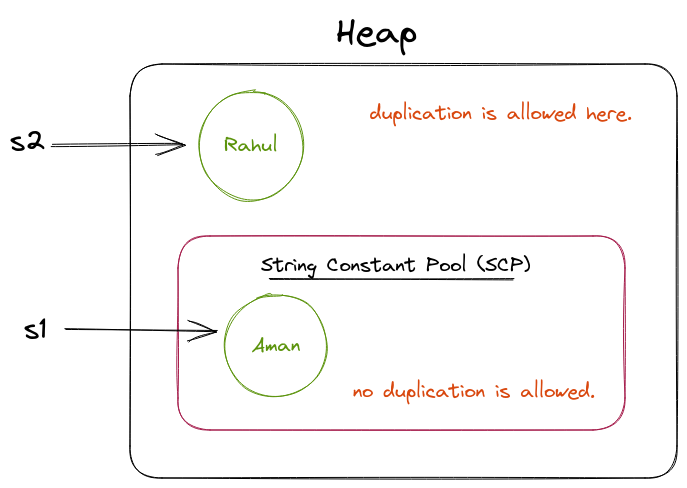
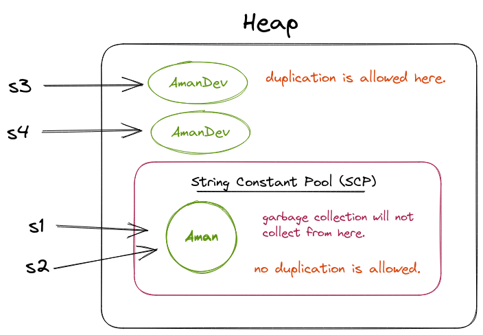

# String Lecture. L-01
- Collection of character that are enclosed in double quotes.
- String -> Object -> Memory Allocation is in Heap.
- if type name start with a capital letter then it is a class, therefore String is a Class that provide many methods.
- Any package we can use without importing then we can consider that package exists inside java.lang.

# Types of String. L-02

## Immutable String (non-changable)
- String.
```
String str1 = "Aman";
str.concat("Dev"); 
System.out.println(str1); // Aman
```
## Mutable String (changable)
- String Buffer.
- String Builder.
```
StringBuilder str2 - new StringBuilder("Aman");
str2.append("DEV");
System.out.println(str2); // AmanDEV
```

# Immutable String and Heap Memory. L-03
### Difference b/w normal and new String()

- If declaration of a string starts without `new` keyword, then memory allocate inside `String Constant Pool` area which is inside heap.
- If not without new Keyword, then memory allocation is outside the `SCP` region.
```
String s1 = "Aman";
String s2 = new String("Rahul");
```


> Example 2
```
String s1 = "Aman";
String s2 = "Aman";

String s3 = new String("AmanDev");
String s4 = new String("AmanDev");

```


* A copy of s3 and s4 will be generated inside `SCP`, JVM handles it.
* garbage collector will not collect anything inside `SCP`.

### Reference Compare ( == )
```
s1 == s2 // true
s3 == s4 // false
```

# Assignments Question

## Q1. What is String ? 
String is a collection of characters. It refers to an Object in java present in a package called java.lang.String. String object is by default immutable, meaning once the object is created we cannot change the value of the object, if we try to change then those changes will be reflected on the new object not on the existing object.
## Q2. Types of String in Java are ?
Java strings are classified into 2 types: <br>
 1. Mutable String    
 2. Immutable String

## Q3. In how many ways you can create a String Object in java ?
In 3 ways:
1. String Literals. 
    * ```String varname = "Aman";```
2. new keyword
    * ```String varname = new String("Aman"); ```
3. Using character Array
    * ``` 
    char[] ch = { 'A','m','a','n' };
    String varname = new String(char);
      ```

## Q4. What is a String constant pool in java ?
String constant pool in java is a special storage space in java heap memory where string literals are stored
1. In SCP duplications are not permitted.
2. Garbage collector cannot access the SCP area.
3. All SCP objects will be destroyed only at the time of JVM shutDown.


## Q5. What do you mean by mutable and immutable Objects ?
### Mutable : 
if we create a String, on that string if we try to perform any operation and those changes get reflected in the same object then such strings are called “Mutable String”.
Ex. StringBuilder, StringBuffer
### Immutable :
if we create a String, on that String if we try to perform any operation then those changes won’t be reflected in the same object, rather than a new object will be created, Such type of string is called as “Immutable String”.
Ex. String

## Q6. Where exactly is the string constant pool is located in a memory ?
String constant pool is located in the heap memory.


